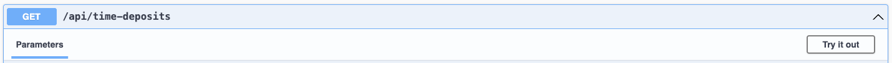
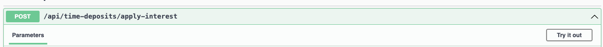

## Test task requirements

Please find the full requirements here: https://github.com/YuliaMittova/time-deposit-take-home-task

## How to run

### Prerequisites

* Java 17 - make sure that you have JAVA_HOME env parameter installed
* Maven

### Start the application:

Please run the following line from your command line:
```bash
  mvn spring-boot:run
```

When the app starts:

* An in-memory H2 database is created.
* Hibernate generates the schema with the correct table and column names
* A small set of test data is inserted at startup via a CommandLineRunner bean (see implementation in InitDataConfig
  class).
  (This replaces the need for a "seed" the data because test requirements only allow exactly 2 endpoints)

### API docs / Swagger

Once the app is running, please open Swagger UI:

* http://localhost:8080/swagger-ui/index.html#
  This shows the 2 required endpoints.

To see the current data about your deposits:
* Click "/api/time-deposits" GET request
 
* Click "Try it out"
* Click "Execute" button

If you want to update all current deposits please do the following:
* Click "/api/time-deposits/apply-interest" POST request
  
* Click "Try it out"
* Click "Execute" button
* To check the result please use "/api/time-deposits" option described above

